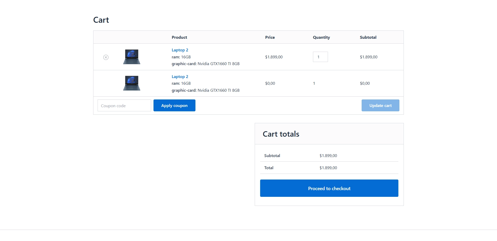
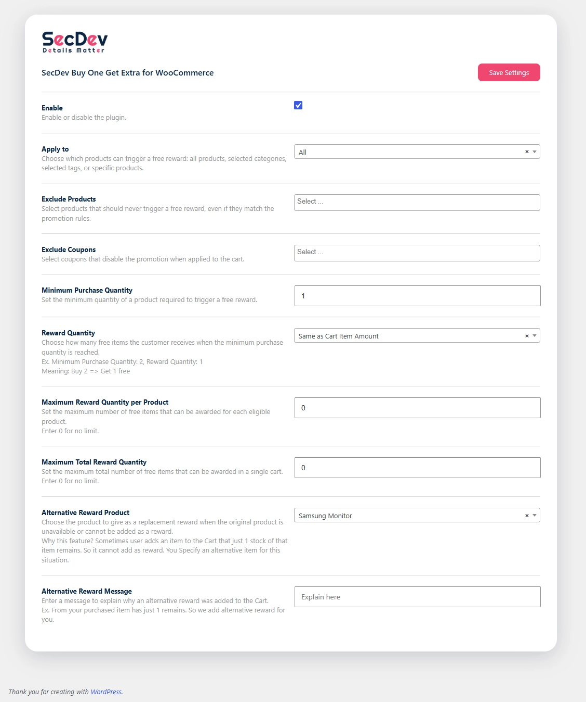

<h1>SecDev Buy One Get Extra for WooCommerce</h1>

**SecDev Buy One Get Extra for WooCommerce** Automatically reward customers with free products when they purchase eligible items.

SecDev Buy One Get Extra for WooCommerce Automatically reward customers with free products when they purchase eligible items. Apply promotions to all products, selected categories, tags, or specific products.
The plugin automatically monitors the customer's cart and adds free reward products when the required quantity of eligible products is reached. Rewards are automatically updated when product quantities change and removed when the promotion requirements are no longer met.
You can apply promotions to all products, selected categories, product tags, or specific products. You can also exclude products and coupons, limit the number of free products per item or across the entire cart, and configure an alternative reward product.
Reward products are managed automatically and cannot be manually removed or have their quantity changed by customers.
The plugin works directly with the WooCommerce cart and keeps reward products synchronized with the current cart contents.

## Features

* Automatically add free reward products to the WooCommerce cart.
* Create quantity-based **SecDev Buy One Get Extra for WooCommerce** promotions.
* Apply rewards to:

  * All products
  * Specific categories
  * Specific product tags
  * Specific products
* Define a minimum quantity required to receive a reward.
* Configure how many free products are awarded based on the purchased quantity.
* Set a maximum number of free products per eligible item.
* Set a maximum total number of free products for the entire cart.
* Use an alternative reward product when configured.
* Exclude specific products from the promotion.
* Exclude specific coupons from the promotion.
* Automatically remove rewards when an excluded coupon is applied.
* Automatically remove rewards when the required product quantity is no longer met.
* Automatically remove rewards when the triggering product is removed from the cart.
* Prevent customers from manually removing reward products.
* Prevent customers from changing the quantity of reward products.
* Keep reward products synchronized automatically whenever WooCommerce recalculates cart totals.
* Display an alternative reward product message in the cart when configured.

  

## How It Works

The plugin continuously monitors the WooCommerce cart and synchronizes reward products based on your configured promotion rules.

A typical flow looks like this:

1. A customer adds an eligible product to the cart.
2. The plugin checks whether the product matches your targeting rules.
3. The plugin checks whether the required minimum quantity has been reached.
4. The reward quantity is calculated according to your configuration.
5. A reward product is resolved and added to the cart.
6. The reward item is automatically marked as a reward and made free.
7. If the customer changes the cart, the reward is automatically updated or removed when necessary.

## Promotion Targeting

You can choose where the promotion should apply.

### All Products

Apply the promotion to all eligible products in your store.

### Product Categories

Apply the promotion only to products belonging to selected WooCommerce categories.

### Product Tags

Apply the promotion only to products with selected product tags.

### Specific Products

Apply the promotion only to selected products.

## Reward Quantity Rules

The plugin allows you to configure several rules that control how rewards are calculated.

### Minimum Quantity

Set the minimum number of eligible products a customer must purchase before receiving a reward.

If the quantity drops below the configured minimum, the associated reward is automatically removed.

### Reward Amount

Configure the reward amount used by the reward calculation system.

The plugin calculates the number of rewards based on the quantity of the triggering product and the configured reward rules.

### Maximum Free Quantity Per Item

Limit the maximum number of free products that can be awarded for each eligible cart item.

### Maximum Total Free Quantity

Limit the total number of free reward products that can be added across the entire cart.

This allows you to control promotions even when customers purchase multiple eligible products.

## Alternative Reward Product

You can configure an alternative reward product for your promotion.

When applicable, the plugin resolves the appropriate reward product and can display an alternative reward message in the WooCommerce cart.

## Product Exclusions

Specific products can be excluded from the promotion.

If an excluded product is present as a potential triggering product, no reward will be assigned for that product.

## Coupon Exclusions

You can select coupons that are incompatible with the promotion.

When one of the configured excluded coupons is applied:

* All reward products are removed from the cart.
* No rewards are synchronized while the excluded coupon is active.

## Automatic Cart Synchronization

Reward products are automatically synchronized when WooCommerce calculates cart totals.

This means the plugin reacts automatically when:

* Product quantities change.
* Eligible products are added to the cart.
* Product quantities fall below the required minimum.
* Excluded coupons are applied.
* Triggering products are removed.
* Cart contents are updated.

The goal is to ensure that the reward quantity always matches the current state of the customer's cart.

## Protected Reward Products

Reward items are managed automatically by the plugin.

Customers cannot:

* Remove reward products manually.
* Change the quantity of reward products manually.

If the triggering product is removed from the cart, its associated reward is also removed automatically.

## Configuration

Configure the plugin through its settings page and define the following options:

| Setting                                | Description                                                                                   |
| -------------------------------------- | --------------------------------------------------------------------------------------------- |
| Enable Promotion                       | Enable or disable the plugin functionality.                                                   |
| Apply To                               | Choose whether the promotion applies to all products, categories, tags, or selected products. |
| Categories                             | Select eligible product categories.                                                           |
| Tags                                   | Select eligible product tags.                                                                 |
| Products                               | Select specific eligible products.                                                            |
| Minimum Purchase Quantity              | Set the minimum quantity required to activate the reward.                                     |
| Reward Amount                          | Configure the reward quantity rule.                                                           |
| Maximum Reward Quantity per Product    | Limit rewards generated by an individual eligible item.                                       |
| Maximum Total Reward Quantity          | Limit the total number of free rewards in the cart.                                           |
| Alternative Reward Product             | Select an alternative product to use as a reward.                                             |
| Excluded Products                      | Prevent selected products from generating rewards.                                            |
| Excluded Coupons                       | Remove and disable rewards when selected coupons are applied.                                 |
| Alternative Reward Message             | Configure the message displayed for the alternative reward product.                           |

## Requirements

* WordPress
* WooCommerce
* PHP version compatible with your plugin's implementation

## Example Use Case

Suppose you want to run a promotion where customers receive free products after purchasing a minimum quantity of eligible products.

You could configure the plugin to:

* Apply the promotion to a specific category.
* Require a minimum purchase quantity.
* Define the reward amount.
* Limit the number of free products per item.
* Limit the total number of free products per cart.
* Exclude certain products from the promotion.
* Disable rewards when a specific coupon is used.

The plugin will then automatically manage the reward products as customers add, remove, or update items in their cart.

## How Rewards Are Managed

Reward products are synchronized automatically with their triggering products.

If a customer:

* Increases the quantity of an eligible product, the reward quantity can be updated.
* Decreases the quantity below the minimum requirement, the reward is removed.
* Removes the triggering product, the associated reward is removed.
* Applies an excluded coupon, all reward products are removed.

This ensures that customers cannot keep rewards that no longer match the promotion requirements.

## Developer Notes

The plugin uses a modular structure for handling:

* Product eligibility
* Reward calculation
* Reward product resolution
* Reward cart management
* Cart restrictions
* Reward cleanup
* Coupon exclusions
* Alternative reward messaging
* Plugin settings

The reward synchronization process is connected to WooCommerce's cart total calculation, allowing the plugin to keep reward items aligned with the current cart state.

## Support

For support, feature requests, or bug reports, please email to => ehsan.pishyar@gmail.com
